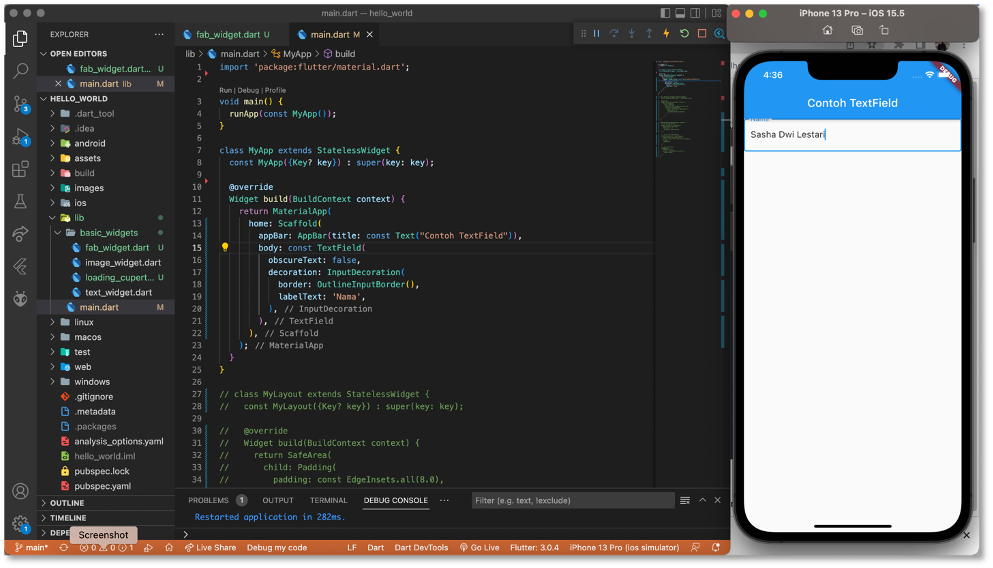

# Hello World Flutter Project

A new Flutter project.

# Praktikum 1 : Membuat Project Flutter Baru

## Langkah 1

Buka VS Code, lalu tekan tombol **Ctrl + Shift + P**, maka akan tampil Command Pallete, lalu ketik **Flutter** pilih **New Application Project**


## Langkah 2

Pilih lokasi folder project, lalu pilih **Select a folder to create the project in**.


## Langkah 3 

Buat nama project **flutter hello_world** seperti berikut, lalu tekan Enter. Tunggu proses selesai.


## Langkah 4

Jika sudah selesai, maka akan tampil sebagai berikut.


# Praktikum 2 : Membuat Repository GitHub dan Laporan Praktikum

## Langkah 1

Login ke akun **GitHub**, lalu buat repository baru dengan nama **"flutter-fundamental-part1"**.


## Langkah 2

Lalu klik tombol **"Create repository"**, kemudian akan tampil seperti gambar berikut.


## Langkah 3

Kembali ke VS code, project flutter **hello_world**, buka terminal pada menu **Terimnal > New Terminal**. Lalu ketikkan perintah berikut untuk inisialisasi git pada project. 


## Langkah 4

Pilih menu Source Control di bagian kiri, lalu lakukan **stages(+)** pada file `.gitignore` untuk mengunggah file pertama ke repository Github.


## Langkah 6

Lakukan push dengan klik bagian menu titik tiga > **Push**.

## Langkah 7

Ketikkan perintah berikut pada terminal untuk mengupload ke GitHub. 


## Langkah 8

Lakukan hal yang sama pada file README.md


## Langkah 9 

Lakukan push juga untuk semua file lainnya dengan pilih **Stage All Changes**. Beri pesan commit **"project hello_world"**. Maka akan tampil di repository sebagai berikut. 


## Langkah 10 

Untuk menjalankan aplikasi bika tekan **F5** atau **Run > Start Debugging**.


## Langkah 11

Menampilkan teks nama pada aplikasi. 


# Praktikum 3 : Menerapkan Widget Dasar

## Langkah 1 : Text Widget

Buat folder baru `basic_widgets` di dalam folder lib. Kemudian buat file baru di dalam basic_widgets dengan nama text_widget.dart. Ketik atau salin kode program berikut ke project hello_world pada file `text_widget.dart`


## Langkah 2 : Image Widget

Buat sebuah file `image_widget.dart` di dalam folder `basic_widgets` dengan isi kode berikut.


# Praktikum 4 : Menerapkan Widget Material Design dan iOS Cupertino

## Langkah 1 : Cupertino Button dan Loading Bar

Buat file di `basic_widgets` > `loading_cupertino.dart`. Import stateless widget dari material dan cupertino. Lalu isi kode di dalam method Widget build adalah sebagai berikut.


## Langkah 2 : Floating Action Button (FAB)

Button widget terdapat beberapa macam pada flutter yaitu ButtonBar, DropdownButton, TextButton, FloatingActionButton, IconButton, OutlineButton, PopupMenuButton, dan ElevatedButton.

Buat file di `basic_widgets` > `fab_widget.dart`. Import stateless widget dari material. Lalu isi kode di dalam method Widget build adalah sebagai berikut.


## Langkah 3 : Scaffold Widget

Scaffold Widget digunakan untuk mengatur tata letak sesuai dengan material design. 


## Langkah 4 : Dialog Widget

Dialog widget pada fluttter memiliki dua jenis dialog yaitu `AlertDialog` dan `SimpleDialog`. Ubah isi kode `main.dart` seperti berikut.


## Langkah 5 : Input dan Selection Widget 

Flutter menyediakan widget yang dapat menerima input dari pengguna aplikasi yaitu antara lain Checkbox, Date and Time Pickers, Radio Button, Slider, Switch, TextField.

Contoh penggunaan TextField Widget adalah sebagai berikut :




## Langkah 6 : Date and Time Pickers

Date and Time Pickers termasuk pada kategori input dan selection widget, berikut adalah contoh penggunaan Date and Time Pickers!


# Tugas Praktikum

### 1. Scaffold Widget

    Diimplementasikan pada file `main.dart`.

    Source Code 

```
import 'package:flutter/material.dart';
import 'package:hello_world/basic_widgets/date_time_widget.dart';
import 'package:hello_world/basic_widgets/dialog_widget.dart';
import 'package:hello_world/basic_widgets/input_widget.dart';

void main() {
  runApp(const MyApp());
}

class MyApp extends StatelessWidget {
  const MyApp({Key? key}) : super(key: key);

  // This widget is the root of your application.
  @override
  Widget build(BuildContext context) {
    return MaterialApp(
      title: 'Flutter Demo',
      theme: ThemeData(
        primarySwatch: Colors.red,
      ),
      home: const MyHomePage(title: 'My Increment App'),
    );
  }
}

class MyHomePage extends StatefulWidget {
  const MyHomePage({Key? key, required this.title}) : super(key: key);

  final String title;

  @override
  State<MyHomePage> createState() => _MyHomePageState();
}

class _MyHomePageState extends State<MyHomePage> {
  int _counter = 0;

  void _incrementCounter() {
    setState(() {
      _counter++;
    });
  }

  @override
  Widget build(BuildContext context) {
    return Scaffold(
      appBar: AppBar(
        title: Text(widget.title),
      ),
      body: Center(
        child: Column(
          mainAxisAlignment: MainAxisAlignment.center,
          children: <Widget>[
            const DialogWidget(),
            SizedBox(height: 10),
            const InputWidget(),
            SizedBox(height: 10),
            const DateTimePicker(),
            SizedBox(height: 10),
            const Text(
              'You have pushed the button this many times:',
            ),
            Text(
              '$_counter',
              style: Theme.of(context).textTheme.headline4,
            ),
          ],
        ),
      ),
      bottomNavigationBar: BottomAppBar(
        child: Container(
          height: 50.0,
        ),
      ),
      floatingActionButton: FloatingActionButton(
        onPressed: _incrementCounter,
        tooltip: 'Increment Counter',
        child: const Icon(Icons.add),
      ),
      floatingActionButtonLocation: FloatingActionButtonLocation.centerDocked,
    );
  }
}
```

### 2. Dialog Widget
    
    Source Code 

```
import 'package:flutter/material.dart';

class DialogWidget extends StatelessWidget {
  const DialogWidget({Key? key}) : super(key: key);

  @override
  Widget build(BuildContext context) {
    return Padding(
      padding: const EdgeInsets.all(8.0),
      child: ElevatedButton(
        child: const Text('Show alert'),
        onPressed: () {
          showAlertDialog(context);
        },
      ),
    );
  }

  showAlertDialog(BuildContext context) {
    // set up the button
    Widget okButton = TextButton(
      child: const Text("OK"),
      onPressed: () {
        Navigator.pop(context);
      },
    );

    // set up the AlertDialog
    AlertDialog alert = AlertDialog(
      title: const Text("My title"),
      content: const Text("This is my message."),
      actions: [
        okButton,
      ],
    );

    // show the dialog
    showDialog(
      context: context,
      builder: (BuildContext context) {
        return alert;
      },
    );
  }
}
```

### 3. Input & Selection Widget

    Source code 
    
```
// ignore_for_file: prefer_const_constructors

import 'package:flutter/material.dart';

class InputWidget extends StatelessWidget {
  const InputWidget({Key? key}) : super(key: key);

  @override
  Widget build(BuildContext context) {
    return Padding(
      padding: const EdgeInsets.symmetric(horizontal: 20),
      child: TextField(
        obscureText: false,
        decoration: InputDecoration(
          border: OutlineInputBorder(),
          labelText: 'Nama',
        ),
      ),
    );
  }
}
```

### 4. Date & Time Picker

```
import 'dart:async';
import 'package:flutter/material.dart';

class DateTimePicker extends StatefulWidget {
  const DateTimePicker({Key? key}) : super(key: key);

  @override
  State<DateTimePicker> createState() => _DateTimePickerState();
}

class _DateTimePickerState extends State<DateTimePicker> {
  // Variable/State untuk mengambil tanggal
  DateTime selectedDate = DateTime.now();

  //  Initial SelectDate FLutter
  Future<void> _selectDate(BuildContext context) async {
    // Initial DateTime FIinal Picked
    final DateTime? picked = await showDatePicker(
        context: context,
        initialDate: selectedDate,
        firstDate: DateTime(2015, 8),
        lastDate: DateTime(2101));
    if (picked != null && picked != selectedDate) {
      setState(() {
        selectedDate = picked;
      });
    }
  }

  @override
  Widget build(BuildContext context) {
    return Center(
      child: Column(
        mainAxisSize: MainAxisSize.min,
        children: <Widget>[
          Text("${selectedDate.toLocal()}".split(' ')[0]),
          const SizedBox(
            height: 20.0,
          ),
          ElevatedButton(
            onPressed: () => {
              _selectDate(context),
              // ignore: avoid_print
              print(selectedDate.day + selectedDate.month + selectedDate.year)
            },
            child: const Text('Pilih Tanggal'),
          ),
        ],
      ),
    );
  }
}
```


